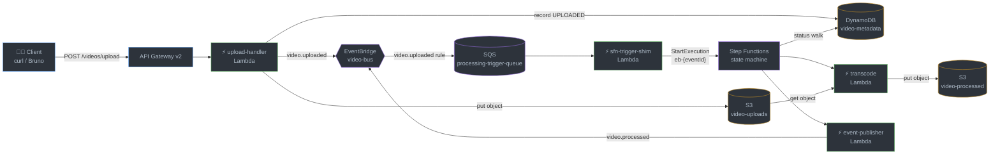

<div align="center">

# 🎬 Serverless Video Processing

**Upload → Transcode → Status/Search — a fully local AWS serverless lab**

[](https://github.com/floci-io/floci)
[](terraform/)
[](lambdas/)
[](lambdas/)
[](#-stack)

*Everything runs on `localhost:4566` — no AWS account, no cloud bill, no `aws cli`.*

</div>

---

## 📖 About

A serverless video-processing platform (upload → transcode → status/search) running
entirely local on [floci](https://github.com/floci-io/floci), a free LocalStack-compatible
AWS emulator. Infrastructure is managed **exclusively with Terraform** — no `aws cli`
in setup/teardown.

## 🏗️ Architecture



> [!NOTE]
> Every edge is live. The trigger leg (rule → queue → shim) exists
> because floci's EventBridge cannot target Step Functions directly —
> the shim is the workaround (Story 2.3, AD-5).

## 🧱 Stack

| Layer | Technology |
|---|---|
| 🖥️ Emulator | floci (`localhost:4566`, no auth token) |
| 🏗️ IaC | Terraform (AWS provider → `http://localhost:4566`) |
| ⚡ Compute | AWS Lambda (`transcode` worker, demo-mode copy; `event-publisher`; `sfn-trigger-shim`) — ffmpeg transcode planned |
| 🎼 Orchestration | Step Functions (`processing-state-machine`) + EventBridge (`video-bus`) + SQS (`processing-trigger-queue`) |
| 💾 Storage | S3 (`video-uploads`, `video-processed`) + DynamoDB (`video-metadata`) |
| 🚪 Ingress | API Gateway v2 (`POST /videos/upload`) |

## 🚀 Quick start

```bash
# 1. Start the emulator
docker compose up -d

# 2. Wait for health (all services "running")
curl -s http://localhost:4566/_localstack/health | python -m json.tool

# 3. Provision infrastructure
cd terraform
terraform init
terraform apply
```

Teardown: `terraform destroy`, then `docker compose down`.

## 📤 Upload journey (Story 1.3)

> [!IMPORTANT]
> The Terraform invoke URL does **not** resolve locally — the gateway data plane
> is reachable only through floci's `_aws/execute-api` mount:
>
> ```
> http://localhost:4566/_aws/execute-api/{apiId}/{stage}/videos/upload
> ```

`api_id` is a Terraform output (`terraform output api_id`); the stage is
`local`. Upload a video:

```bash
API_ID=$(terraform -chdir=terraform output -raw api_id)
curl -s -X POST "http://localhost:4566/_aws/execute-api/$API_ID/local/videos/upload" \
  -F "file=@my-video.mp4;type=video/mp4" -F "title=My Video"
# -> 200 {"videoId": "<uuid4>"}
```

**Side effects** — the object lands in `video-uploads` under `{videoId}/{filename}`
(filename is sanitized — path components and control characters are
stripped), the `video-metadata` record is created with status `UPLOADED`
(title falls back to the filename when the `title` field is absent), and a
`video.uploaded` event with a deterministic UUID5 `eventId` is published to
the `video-bus` EventBridge bus. Malformed requests (missing file part,
unparseable body, empty file, invalid filename) return `400 {"error": ...}`.

> [!WARNING]
> **Known limits (lab scope)**
>
> - **~6 MB payload ceiling.** API Gateway v2 proxy payloads cap at ~6 MB
>   (hard limit on AWS; floci inherits the shape). The handler buffers the
>   whole body in memory — fine for demo clips, not for real video. Presigned
>   URLs are the production answer (deferred).
> - **Partial-failure semantics.** The side-effect chain is S3 → record →
>   event, strictly ordered. If a later step fails, earlier side effects
>   persist (orphaned object/record) and the client gets `500` without a
>   `videoId`; a retry mints a *new* `videoId`. There is no compensation and
>   no client idempotency key — acceptable for the lab, documented here so
>   nobody is surprised.
> - **Event Detail shape.** The wire `Detail` is the envelope with the
>   detail fields promoted to the top level:
>   `{eventId, schemaVersion, videoId, status, bucket, key}`. The flat view
>   is canonical for consumers; the nested `detail` object stays intact for
>   envelope-shaped readers. Detail keys must never collide with envelope
>   keys (`eventId`, `schemaVersion`).
> - **Binary uploads verified (floci >= 1.7.0).** The floci 1.6.0 gateway
>   corrupted binary multipart bodies (UTF-8 string decode — high-byte
>   payloads rejected, valid-UTF-8 byte sequences silently shrunk). Fixed
>   by bumping to floci 1.7.0 (PR #2203: non-text bodies delivered base64,
>   `isBase64Encoded: true` — real-AWS behavior); the upload handler
>   base64-decodes before parsing. A 16 KB all-byte-values payload has been
>   verified end-to-end through the gateway (sha256 match in S3).

### 📮 Bruno collection

`bruno/` holds the API collection — every request targets the gateway base
URL only, never backend endpoints. `bruno/sample.mp4` is a tiny text stub
(`fake-video-bytes-for-bruno`), not a real video — swap in a real file for
realistic testing. Set the `gatewayBaseUrl` variable in
`bruno/environments/Local.bru` (replace the `REPLACE_WITH_API_ID`
placeholder) from the `api_id` output after apply, then:

```bash
cd bruno
bru run --env Local
# or without editing the env file:
bru run --env Local --env-var "gatewayBaseUrl=http://localhost:4566/_aws/execute-api/$API_ID/local"
```

## ⚙️ Transcode worker (Story 2.1)

The `transcode` Lambda (`terraform/transcode.tf`) is the processing leg's
first worker — a **PURE worker** (AD-4): S3 object in → S3 object out, no
status writes, no events. It reads the uploaded object from
`video-uploads` and streams it to `video-processed` under
`processed/{videoId}/{basename}` (demo-mode copy — no ffmpeg; real
transcoding is a documented future extension), then returns
`{videoId, originalKey, processedKey, sizeBytes}` for the state machine
(Story 2.2). Malformed payloads (missing/empty `videoId` or
`originalKey`) raise `MalformedInputError`; unknown source objects fail
the invocation — either failure is exactly what the ASL task needs.
Re-invoking with the same payload overwrites the same processed key
(idempotent).

> [!TIP]
> Invoke ad-hoc via local boto3 (the aws CLI shim is broken):
>
> ```bash
> python -c "import boto3, json; c = boto3.client('lambda', endpoint_url='http://localhost:4566', region_name='us-east-1', aws_access_key_id='test', aws_secret_access_key='test'); print(json.dumps(json.load(c.invoke(FunctionName='transcode', Payload=json.dumps({'videoId': '<uuid>', 'originalKey': '<uuid>/<filename>'}))['Payload']), indent=2))"
> ```

## Processing state machine (Story 2.2)

The `processing-state-machine` (`terraform/processing.tf` +
`terraform/processing.asl.json`) drives the status walk via **direct
service integrations** — status-first ordering is structural, in the ASL
(AD-4):

```
MarkProcessing  Task(dynamodb:updateItem, condition #s = UPLOADED → PROCESSING)
Transcode       Task(lambda:invoke transcode)
MarkProcessed   Task(dynamodb:updateItem, condition #s = PROCESSING → PROCESSED,
                     also SETs processedKey + updatedAt)
PublishProcessed Task(lambda:invoke event-publisher)
```

The ASL's inline condition pairs mirror the shared layer's
legal-transition table (`lambdas/_shared/status.py`) exactly — a
transition-table change is one coordinated ASL + shared-layer change
(backstopped by `lambdas/event_publisher/tests/test_asl_definition.py`).
Input contract = the `video.uploaded` detail
`{videoId, status, bucket, key}` (Story 2.3's shim passes exactly
that). Any task failure fails the execution — no Catch/Retry — so a
re-run for an already-PROCESSED video fails at the first condition with
no status regression and no second event (FR-11 via ASL).

The `event-publisher` Lambda is the **sole constructor** of the
`video.processed` envelope (AD-4/AD-6): the ASL passes it only the
transcode result `{videoId, originalKey, processedKey, sizeBytes}`; the
envelope (deterministic UUID5 `eventId` of `(videoId, PROCESSED)`,
`schemaVersion`, fixed detail shape) is built via the shared layer, with
the detail's `bucket` from its `PROCESSED_BUCKET` env var. Wire Detail
mirrors the upload handler's flat shape.

Start an execution ad-hoc via local boto3 (the aws CLI shim is broken):

```bash
python -c "import boto3, json; c = boto3.client('stepfunctions', endpoint_url='http://localhost:4566', region_name='us-east-1', aws_access_key_id='test', aws_secret_access_key='test'); print(c.start_execution(stateMachineArn='arn:aws:states:us-east-1:000000000000:stateMachine:processing-state-machine', input=json.dumps({'videoId': '<uuid>', 'status': 'UPLOADED', 'bucket': 'video-uploads', 'key': '<uuid>/<filename>'})))"
```

**floci platform facts (binding):**

- floci 1.7.0 supports `UpdateStateMachine` (#1867) — ASL changes apply in
  place. On older floci images they require
  `terraform apply -replace=aws_sfn_state_machine.processing`.
- floci's `lambda:invoke` wraps the Lambda result as
  `{Payload: ..., StatusCode: ...}` like real AWS (floci >= 1.7.0; 1.6.0
  returned it directly). The Transcode task unwraps `$.Payload` via
  `ResultSelector`, so the ASL is identical on floci and real AWS.

> [!WARNING]
> **Retry/FAILED-path stance (accepted lab limitation).** The ASL has no
> Catch/Retry: a transient publisher failure loses the terminal event,
> and a transient mid-execution failure strands the record at
> `PROCESSING` — neither is recoverable via the trigger leg's dedupe
> (the execution name is already taken). Accepted as documented lab
> limitations; a FAILED path + re-drive mechanism is a future design
> decision (tracked before Epic 4's SM-1 verification).

## 🔁 Trigger leg (Story 2.3)

Uploads now **auto-process**: the `video.uploaded` event drives the
state machine with no manual `StartExecution`. floci's EventBridge cannot
target Step Functions directly, so the leg is
(`terraform/trigger.tf`):

```
video.uploaded on video-bus
  → EventBridge rule (video-uploaded-to-processing-trigger)
  → processing-trigger-queue (SQS)
  → sfn-trigger-shim Lambda (event-source mapping, batch_size=1)
  → StartExecution eb-{eventId}
```

The shim parses the SQS body (the full EventBridge event), validates the
flat detail (`eventId` + the four ASL input fields, whitespace-stripped),
and starts the execution with **exactly** the ASL input contract
`{videoId, status, bucket, key}`. Dedupe is by construction: the
execution name `eb-{eventId}` derives from the deterministic UUID5
`eventId` (never the EventBridge top-level `id` — random per emission on
real AWS), so a republish, SQS retry, or redelivery hits
`ExecutionAlreadyExists`, which the shim treats as success (acks the
message). Malformed records are logged and acked (skipped) — never
retried, since a deterministic poison message would retry forever; real
`StartExecution` errors raise so the ESM retries.

## 📁 Repository layout

```
docker-compose.yaml # floci emulator
terraform/          # all AWS resources (buckets, bus, tables, lambdas, gateway)
lambdas/            # Lambda function source code (one dir per function)
bruno/              # Bruno API collection (gateway data plane only)
_bmad-output/       # BMAD planning artifacts (PRD, architecture, epics)
```

## 📊 Status

✅ **Story 2.3 complete** — uploads now auto-process. The trigger leg
(`terraform/trigger.tf`): `video.uploaded` rule → `processing-trigger-queue`
(SQS) → `sfn-trigger-shim` Lambda (event-source mapping) →
`StartExecution eb-{eventId}`. The shim exists because floci's
EventBridge cannot target Step Functions directly; dedupe is by
construction — the deterministic execution name means a republish or
redelivery hits `ExecutionAlreadyExists`, which the shim acks as
success. Malformed records are skipped (acked), real errors retry.
Verified live: gateway upload → record walks to PROCESSED with no manual
invoke; republish dedupes. 42 new tests (173 total).

✅ **Story 2.2 complete** — the `processing-state-machine` drives
UPLOADED → PROCESSING → PROCESSED via direct DynamoDB `updateItem`
integrations with inline condition pairs mirroring the shared layer's
legal-transition table, invokes the `transcode` worker in between, and
ends with the `event-publisher` Lambda emitting exactly one
`video.processed` event (deterministic UUID5 eventId) on `video-bus`.
Declared in `terraform/processing.tf` + `terraform/processing.asl.json`:
publisher zip/role/function, SFN execution role (least privilege:
GetItem/UpdateItem on `video-metadata` + InvokeFunction on the two
workers only), and the state machine. Verified live: gateway upload →
ad-hoc `StartExecution` → record walks to PROCESSED, processed object
byte-identical, exactly one event with the right eventId/schemaVersion,
history shows all four task states; re-run fails at the first condition
with no regression and no second event. 45 new tests (131 total),
including the ASL↔transition-table mirror backstop.

✅ **Story 2.1 complete** — the `transcode` worker Lambda exists and works
ad-hoc: pure S3 in → S3 out (demo-mode copy, no ffmpeg), no status
writes, no events (AD-4). Declared in `terraform/transcode.tf`:
`video-processed` bucket, least-privilege role (logs + GetObject on
uploads + PutObject on processed), and the `transcode` function
(python3.11, env `UPLOADS_BUCKET`/`PROCESSED_BUCKET`/`AWS_ENDPOINT_URL`).
Verified against a real gateway upload: processed object lands under
`processed/{videoId}/{basename}`, the metadata record stays UPLOADED,
re-invokes are idempotent, and the run is traceable in CloudWatch Logs.
20 new ATDD tests (74 total with the shared layer and upload handler).

✅ **Story 1.3 complete** — the upload journey works end-to-end through
the gateway: `upload-handler` Lambda (raw multipart parse, UUID4 videoId
minted once, S3 put → idempotent `video-metadata` record → deterministic
`video.uploaded` event, all via the shared layer), `video-uploads` bucket,
`video-bus` EventBridge bus, and API Gateway v2 with `POST /videos/upload`
(`terraform/upload.tf`, `api_id` output). Bruno collection founded and
passing.

✅ **Story 1.2 complete** — `lambdas/_shared/` is the single enforcement
point every later function imports: `status.py` (legal-transition table
enforced via DynamoDB conditional writes — `UpdateItem` +
`ConditionExpression`, idempotent create/re-assert), `events.py`
(deterministic UUID5 `eventId` envelopes, fixed detail shapes),
`errors.py` (conflict→409, unknown→404, malformed→400, else 500), and
`clients.py` (env-driven boto3 factories — `AWS_ENDPOINT_URL`, no
hardcoded names). The `video-metadata` table and a `smoke` Lambda fixture
(`terraform/smoke.tf`) run the layer inside floci's real Docker runtime —
smoke confirmed boto3 present in the floci 1.6.0 image, every scenario
passes against the real table, and the fixture cleans up after itself.
27 unit tests.

✅ **Story 1.1 complete** — the lab substrate is reproducible: floci
pinned to `1.6.0` in `docker-compose.yaml` (with the Docker socket
mounted), the Phase 0 smoke resource removed so `terraform/` declares
zero resources (substrate only), the provider `endpoints{}` skeleton
verified, and the README quick-start documented Terraform-only — no
`aws` CLI anywhere in setup/teardown.

⏭️ **Next:** Epic 3 — the status-history surface (history consumer +
`status-history` table, then `GET /videos/{videoId}/history` through the
gateway). See `_bmad-output/`.

---

<div align="center">

*Built with [BMAD](https://github.com/bmad-code-org/BMAD-METHOD) planning · Terraform-only infra · 100% local*

</div>
