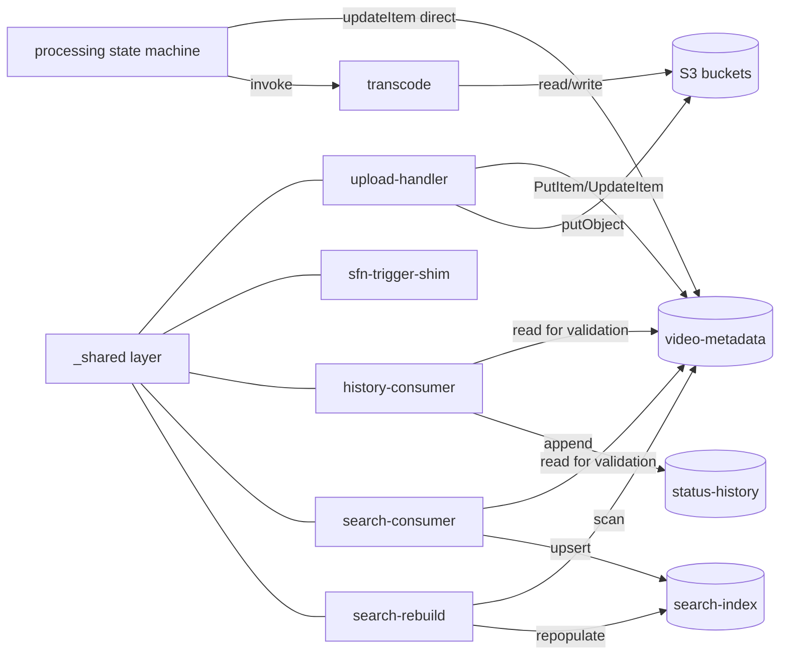
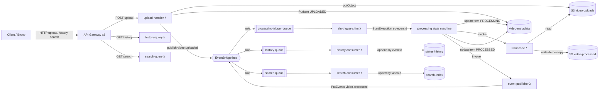
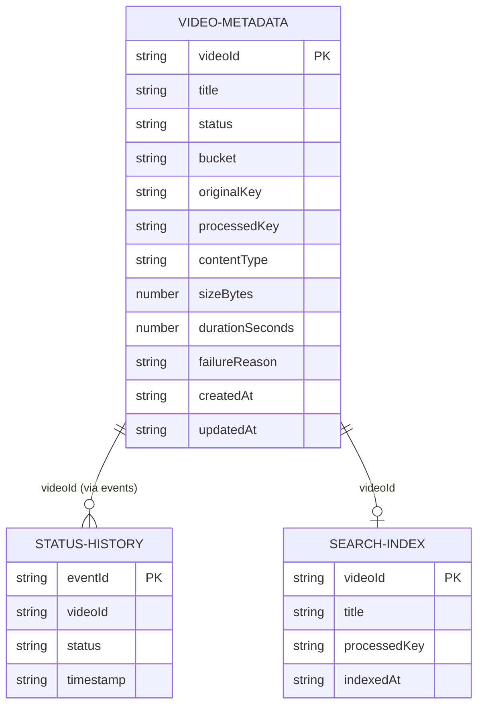

# Architecture Spine — serverless-video-processing

## Design Paradigm

**Event-driven serverless pipeline, single door for the client.** The system is a pipeline `upload → process → history/search` whose stages are decoupled by an EventBridge custom bus and SQS queues — one queue per consumer. The client reaches the system only through the API Gateway v2. The processing leg is orchestrated by a Step Functions state machine that talks to DynamoDB and Lambda via **direct service integrations** (no orchestration Lambda). There is no metadata service: DynamoDB **is** the single source of truth, and the status state machine is enforced by **conditional writes** issued through a shared access layer every function imports. No synchronous Lambda→Lambda invocation exists anywhere — all coordination is events + DynamoDB.

Namespace map:

```text
lambdas/<function-name>/     # one dir per function; handler.py + shared layer ref
lambdas/_shared/             # the shared access layer: state machine, event shapes, DDB/S3/EB clients
terraform/                   # the entire environment — buckets, tables, functions, bus, queues, SFN, gateway, IAM
docker-compose.yaml          # floci only (Docker socket mounted)
```

## Invariants & Rules

### AD-1 — Event backbone: EventBridge bus + SQS queue per consumer [ADOPTED]

- **Binds:** all publishers, all consumers, the bus, all queues
- **Prevents:** point-to-point wiring between functions, consumers inventing their own transport, and the PRD's redelivery/idempotency semantics (FR-9, FR-15, NFR-1) having no honest home
- **Rule:** one custom EventBridge bus carries all domain events. Routing is normative: `video.uploaded` → processing-trigger queue only; `video.processed` → history queue and search queue only. Every consumer sits behind its own SQS queue (at-least-once); no consumer is invoked directly by the bus except where AD-5 mandates the shim. SNS is not used. A new consumer = new queue + new rule target, never a change to an existing consumer.

### AD-2 — State machine enforced by DynamoDB conditional writes via a shared access layer [ADOPTED]

- **Binds:** every function that reads or mutates the video record; `lambdas/_shared/`
- **Prevents:** two functions implementing divergent transition logic, status regression under redelivery, and a synchronous metadata-Lambda reintroducing RPC between functions
- **Rule:** there is **no metadata service-Lambda**. Transitions `UPLOADED → PROCESSING → PROCESSED | FAILED` (terminals final) are enforced by `UpdateItem` with `ConditionExpression: #s = :expected` issued through the shared access layer — the **table** rejects illegal transitions (`ConditionalCheckFailedException`), not a middleman. Same-status re-assertion is idempotent (condition matches, update applies, no event emitted). **Create is idempotent by `videoId`** (FR-12): `PutItem` with `ConditionExpression: attribute_not_exists(videoId)`; on condition failure the shared layer returns the existing record unchanged (idempotent success, not an error) — with a single ingress minter, a retry with one's own id is the only reachable case. The shared layer is the only code that knows the legal-transition table; functions never hand-write status `UpdateItem`s. Producer assignment: `UPLOADED` minted only by the upload handler; `PROCESSING`/`PROCESSED`/`FAILED` minted only by the processing state machine (AD-4).

```mermaid
stateDiagram-v2
    [*] --> UPLOADED: upload handler (PutItem, condition: attribute_not_exists)
    UPLOADED --> PROCESSING: state machine at transcode start
    PROCESSING --> PROCESSED: state machine at completion
    PROCESSING --> FAILED: state machine on failure (rules only; nothing produces FAILED in v1)
    PROCESSED --> [*]
    FAILED --> [*]
```



### AD-3 — Multiple DynamoDB tables, one entity per table [ADOPTED]

- **Binds:** `video-metadata`, `status-history`, `search-index` tables; all functions touching them
- **Prevents:** functions assuming a single-table key scheme, derived stores being treated as source of truth, and rebuild semantics becoming ambiguous
- **Rule:** three tables — `video-metadata` (PK `videoId`, the single source of truth), `status-history` (PK `eventId`, append-only, derived), `search-index` (PK `videoId`, upsert, derived). Derived tables are disposable and rebuildable from `video-metadata`. No function reads a derived table to answer a question the metadata table owns. Title-substring search = `Scan` with contains filter (no substring GSI exists; lab scale, NFR-7). Single-table design is a deferred learning surface, not a v1 shape.

### AD-4 — Step Functions orchestrates the processing leg via direct service integrations [ADOPTED]

- **Binds:** `processing-state-machine`, `transcode-lambda`
- **Prevents:** the state machine becoming a decorative wrapper around one do-everything Lambda, and transition/event ordering being enforced in code instead of in the ASL
- **Rule:** the state machine's states, in order: `Task(dynamodb:updateItem UPLOADED→PROCESSING)` → `Task(lambda:invoke transcode)` → `Task(dynamodb:updateItem →PROCESSED)` → `Task(lambda:invoke event-publisher)`. Status-first ordering is structural — each `updateItem` completes before the next state runs; the terminal event is published only after the terminal transition is acknowledged. The transcode Lambda is a **pure worker**: S3 object in → S3 object out (demo-mode copy fallback when ffmpeg absent); it performs no status writes and publishes no events. The **event-publisher Lambda is the sole constructor of the `video.processed` envelope** (eventId derivation, schemaVersion, detail shape — via the shared layer, AD-6); the ASL passes it only the domain payload (videoId, status, keys). floci 1.6.0 does not support the `arn:aws:states:::events:putEvents` direct integration (spike-verified) — the publisher Lambda is mandatory, not a fallback. **Transition-table consistency:** the ASL's inline condition pairs (`#s = UPLOADED` → `PROCESSING`, etc.) are the authoritative encoding for the processing leg and MUST mirror the shared layer's legal-transition table (AD-2); a transition-table change is one coordinated spine-level change (ASL + shared layer together). A failed `updateItem` condition (redelivered trigger for an already-advanced video) fails the execution — the shim's dedupe (AD-5) makes that unreachable in practice; the FAILED path is deferred.

### AD-5 — video.uploaded → Step Functions via queue-based shim (floci constraint) [ADOPTED]

- **Binds:** `sfn-trigger-shim-lambda`, the processing-trigger queue, the `video.uploaded` rule
- **Prevents:** duplicate state-machine executions on redelivery/republish, and a direct EventBridge→SFN target that floci cannot execute
- **Rule:** floci 1.6.0's EventBridge invoker does not support state-machine targets (spike-verified). Therefore: `video.uploaded` → processing-trigger queue → shim Lambda → `StartExecution`. The shim derives the execution name deterministically from the event's `eventId` (`eb-{eventId}`) — a republish hits `ExecutionAlreadyExists` and is a dedupe, never a second execution (extends NFR-2 to the trigger leg). The shim treats `ExecutionAlreadyExists` as success (ack). If floci later supports SFN targets natively, the shim is replaced by a direct target — a Terraform-only change.

### AD-6 — Identity, events, and publisher allow-list [ADOPTED]

- **Binds:** all publishers, all consumers, all event payloads
- **Prevents:** split identity authority, duplicate terminal events, shape drift between record and events, and a consumer becoming a second producer
- **Rule:** `videoId` = UUID minted exactly once at ingress (upload handler); the same id appears in the S3 key, the metadata record, and every event. `eventId` = deterministic name-based UUID derived from `(videoId, status)` — stateless, restart-proof; redelivery and publish-retry reuse the same id, so "exactly one event per transition" holds across restarts. Every event carries `eventId` + `schemaVersion`; event names are verb-in-past (`video.uploaded`, `video.processed`). **Wire Detail shape (as-built, reconciled 2026-08-21):** publishers put a FLAT Detail on the bus — the envelope fields with the detail fields promoted to the top level: `{eventId, schemaVersion, videoId, status, bucket, key, detail}` (and `originalKey`/`processedKey` in place of `key` for `video.processed`). The flat view is canonical for consumers (Epic 2's consumers and the trigger-leg shim read it flat); the nested `detail` object stays intact for envelope-shaped readers. Detail keys must never collide with envelope keys (`eventId`, `schemaVersion`). Publisher allow-list: only the upload handler publishes `video.uploaded`; only the event-publisher Lambda (invoked by the processing state machine, AD-4) publishes `video.processed` — and it is the sole constructor of that envelope. Consumer dedupe keys on `eventId`; `status-history` natural key = `eventId` (append per unique event), `search-index` natural key = `videoId` (upsert). **Status-filtered consumption:** the search consumer indexes only events with `status = PROCESSED` (a `FAILED` terminal event is never indexed); the history consumer records every terminal event it consumes. Poison handling (FR-15): an event whose `videoId` the metadata table reports unknown is dropped (successful negative lookup); transient errors are retried, never dropped.

### AD-7 — Error semantics [ADOPTED]

- **Binds:** all client-facing Lambdas, the gateway
- **Prevents:** each function inventing its own error vocabulary or envelope
- **Rule:** client-facing HTTP returns 400/404/409/500 with body `{"error": "<message>"}`. The shared layer maps: `ConditionalCheckFailedException` on a transition → 409; unknown `videoId` → 404; malformed input → 400; else 500. The gateway passes responses through unchanged — no remapping at the edge. No auth on any surface (lab).

### AD-8 — Config not code + floci platform constraints [ADOPTED]

- **Binds:** all Lambda code, `terraform/`, `docker-compose.yaml`, the test collection
- **Prevents:** hardcoded endpoints breaking the real-AWS path, and the three spike-discovered floci gaps silently resurfacing during the build
- **Rule:** no endpoint, region, credential, or resource name is hardcoded in function code — all come from Lambda environment variables set by Terraform (`AWS_ENDPOINT_URL`, table/bucket/bus/queue names, `STATE_MACHINE_ARN`). Function-to-floci calls use `AWS_ENDPOINT_URL` (resolves to `host.docker.internal:4566` from inside Lambda containers — spike-verified). Four floci platform facts are binding: (1) `docker-compose.yaml` MUST mount `/var/run/docker.sock` into the floci container or no Lambda runs; (2) the gateway data plane is reached at `http://localhost:4566/_aws/execute-api/{apiId}/{stage}/{path}` — the Terraform-output invoke URL does not resolve locally, so the test collection and README use the `_aws/execute-api` form with `apiId` exposed as a Terraform output; (3) the Terraform provider `endpoints{}` block must list every service used (a missing endpoint yields `InvalidClientTokenId` 403s); (4) floci does not support `UpdateStateMachine` — any state-machine definition change requires `terraform apply -replace=aws_sfn_state_machine.<name>` (destroy+recreate), and the two unsupported direct integrations (EventBridge→SFN targets, `events:putEvents`) mandate the shim (AD-5) and publisher (AD-4) Lambdas. Ad-hoc API inspection: EventBridge uses `application/x-amz-json-1.1`; Step Functions and DynamoDB use `1.0`; Lambda uses REST paths.

### AD-9 — Terraform-managed environment, fixed bring-up order [ADOPTED]

- **Binds:** `terraform/`, `docker-compose.yaml`, the setup/teardown procedure
- **Prevents:** out-of-band resource creation, drift between declared and actual environment, and an irreproducible lab bring-up
- **Rule:** every resource (buckets, tables, functions, bus, rules, queues, event-source mappings, state machine, gateway API/routes/integrations/stage, IAM roles) is declared in Terraform and created by `terraform apply` against floci (`http://localhost:4566`, dummy creds, `s3_use_path_style=true`, local state). Bring-up order is fixed: `docker compose up` → `terraform apply` → exercise via Bruno/curl through the gateway only. `terraform destroy` + re-apply rebuilds everything; the documented setup/teardown contains no `aws` CLI invocations (ad-hoc inspection only, never setup). Lambda code lives in `lambdas/<name>/`, zipped by Terraform.

Dependency direction — who may touch what:



No function touches a store it does not own per this diagram; the state machine is the only mutator of `video-metadata` status after ingress; derived tables have exactly one writer each (history-consumer, search-consumer, search-rebuild).

## Consistency Conventions

| Concern | Convention |
| --- | --- |
| Naming (entities, files, interfaces, events) | Events verb-in-past: `video.uploaded`, `video.processed`; queues `<purpose>-queue` (processing-trigger, history, search); buckets `video-uploads`, `video-processed`; tables `video-metadata`, `status-history`, `search-index`; one dir per function under `lambdas/`; all names declared in Terraform, consumed via env vars, never string-typed in code (AD-8) |
| Data & formats (ids, dates, error shapes, envelopes) | `videoId` UUID minted at ingress (AD-6); `eventId` deterministic from `(videoId, status)`; timestamps ISO-8601 UTC strings; event payloads JSON carrying `eventId` + `schemaVersion` + `detail`; SQS-delivered events arrive as `Records[].body` = JSON-stringified EventBridge envelope — consumers unwrap `body → detail`; HTTP error body `{"error": ...}` (AD-7); **the gateway delivers multipart bodies RAW** (`isBase64Encoded: false`, spike-verified) — the upload handler parses multipart itself, never assumes base64 |
| State & cross-cutting (mutation, errors, logging, config, auth) | Status mutated only via shared-layer conditional writes (AD-2) or state-machine `updateItem` tasks (AD-4); logging = print/structlog to CloudWatch Logs via floci (NFR-5); config only via Lambda env vars (AD-8); no auth anywhere (lab) |

Authoritative gateway route table (FR-21 — routes map 1:1 to the three client journeys; declared in Terraform, mirrored by the handler wiring; changing a path is a spine change):

| Client journey | Gateway route | Target |
| --- | --- | --- |
| Upload | `POST /videos/upload` (multipart/form-data) | upload-handler λ |
| Status history | `GET /videos/{videoId}/history` | history-query λ |
| Search | `GET /videos/search?title=` | search-query λ |

## Stack

| Name | Version |
| --- | --- |
| floci (local AWS emulator) | 1.6.0 (`floci/floci:latest` pinned at authoring; Docker socket mounted) |
| Terraform | 1.6.1 (>= 1.6.0) |
| hashicorp/aws provider | 5.100.0 (~> 5.0) |
| Lambda runtime | python3.11, zip-packaged (stdlib-only verified; boto3 assumed present in runtime image — see Deferred) |
| Docker | Docker Desktop (host daemon reached via mounted socket + `host.docker.internal`) |
| Test client | Bruno or curl scripts (reproducible collection, FR-22) |

## Structural Seed



```text
{root}/
  docker-compose.yaml        # floci only — Docker socket mounted (AD-8)
  terraform/                 # the entire environment (AD-9)
  lambdas/
    _shared/                 # state machine, event shapes, clients (AD-2, AD-6)
    upload-handler/          # ingress; mints videoId; publishes video.uploaded
    sfn-trigger-shim/        # queue -> StartExecution (AD-5)
    transcode/               # pure worker; demo-mode copy fallback
    event-publisher/         # sole constructor of the video.processed envelope (AD-4, AD-6)
    history-consumer/        # video.processed -> status-history
    search-consumer/         # video.processed -> search-index
    history-query/           # gateway read surface
    search-query/            # gateway read surface
    search-rebuild/          # admin-only direct invoke (FR-19)
  bruno/                     # reproducible test collection (FR-22)
```

Core entities (names + relationships only):



## Capability → Architecture Map

| Capability / Area | Lives in | Governed by |
| --- | --- | --- |
| Upload ingest (FR-1..4) | upload-handler λ | AD-2, AD-6, AD-7, AD-8 |
| Processing pipeline (FR-5..9) | state machine + transcode λ + event-publisher λ + sfn-trigger-shim λ | AD-1, AD-4, AD-5, AD-6 |
| Metadata & state machine (FR-10..13) | video-metadata table + `_shared` layer | AD-2, AD-3, AD-6, AD-7 |
| Status history (FR-14..16) | history-consumer λ + status-history table + history-query λ | AD-1, AD-3, AD-6, AD-7 |
| Search (FR-17..19) | search-consumer λ + search-index table + search-query λ + search-rebuild λ | AD-1, AD-3, AD-6, AD-7 |
| Client ingress (FR-20..22) | API Gateway v2 (terraform/) + bruno/ | AD-7, AD-8, AD-9 |
| Infrastructure as Code (FR-23..24) | terraform/ + docker-compose.yaml | AD-8, AD-9 |

## Deferred

- **Presigned-URL ingest (v2 learning variant)** — discussed and deliberately deferred (user decision). v1 keeps multipart-through-gateway upload; v2 reworks ingest to the production pattern: presigner λ via gateway returns `{videoId, uploadUrl}`, client PUTs bytes direct to S3 (API GW's 10MB payload limit makes byte-proxying infeasible on real AWS anyway), S3 `ObjectCreated` → SQS → shim (floci shape; real AWS: S3→EventBridge→SFN direct). `video.uploaded` is retired in v2; dedupe via execution name `upload-{videoId}`. Full derivation in the memlog. Revisit: after SM-1 is green.
- **FAILED-producing path** — state-machine rules exist; nothing produces FAILED in v1 (PRD out-of-scope). Revisit when a failure demo is wanted.
- **Real ffmpeg transcoding** — demo-mode copy fallback for v1; container-image Lambda with ffmpeg is a documented future extension (PRD A-3).
- **boto3 in the floci runtime image** — assumed present (standard AWS base images); the spike stayed stdlib-only via urllib. Confirm in the first real function story; fallback proven.
- **Single-table DynamoDB design** — deferred learning surface; v1 uses one table per entity (AD-3). Revisit as a deliberate exercise.
- **Event-schema versioning policy** — `schemaVersion` is carried but versioning is not a feature (PRD out-of-scope).
- **SQS DLQ / retry / redrive policy** — not needed for the happy path; add when failure handling matures.
- **Ingest-leg reconciliation** — a lost `video.uploaded` orphans the video in UPLOADED (accepted for the lab).
- **Real AWS deployment** — floci only for v1; AD-8 keeps code endpoint-agnostic, but gateway invoke-URL form and shim necessity differ on real AWS (native EventBridge→SFN targets exist there). Revisit with the infra phase.
- **Remote state, modules/workspaces, real-AWS deploy pipeline** — out of scope for the lab (PRD NFR-6). *Amendment 2026-08-19 (user decision):* a local-lab CI pipeline IS in scope — GitHub Actions (`.github/workflows/ci.yml`): lint (ruff E,F + terraform fmt), pytest unit suite, terraform validate, and an ephemeral smoke stage that runs the AD-9 bring-up order on the runner (floci compose → terraform apply → smoke-Lambda invoke → destroy). No remote environment, no secrets; design record in `_bmad-output/test-artifacts/ci-pipeline-progress.md`.
