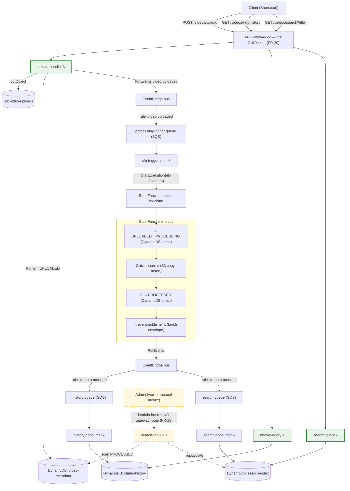

# Solution Design — Serverless Video Processing on floci

*A learning companion to `ARCHITECTURE-SPINE.md`. The spine fixes the rules; this doc explains why each rule exists, so you can defend every decision (SM-3).*

## The one-sentence system

Upload a video through one HTTP door; it flows through S3 → EventBridge → Step Functions → Lambda → DynamoDB, and two derived stores (history, search) get built from the events — everything provisioned by Terraform against a local AWS emulator.

## The topology

**Reading the diagram — three kinds of Lambda:**

- 🟩 **Green = gateway-facing** — the only Lambdas Bruno can ever reach: `upload-handler`, `history-query`, `search-query`. All three client journeys enter through the one gateway node (FR-20 single ingress; FR-22 test collection goes through the gateway *only*).
- ⬜ **Plain = internal workers** — invoked exclusively by AWS services, no HTTP surface exists to reach them: `sfn-trigger-shim` (by SQS), `transcode` + `event-publisher` (by Step Functions tasks), `history-consumer` + `search-consumer` (by SQS). A client request can no more hit these than it can hit DynamoDB directly.
- 🟨 **Dashed = admin-only** — `search-rebuild` is invoked by hand (`lambda invoke`), deliberately has **no** gateway route: FR-19 fixes the rebuild trigger as admin-only with no client-facing surface. That's why it's not in the Bruno collection.

## Why each decision (the rationale the spine omits)

### Why EventBridge bus + SQS queue per consumer (AD-1)
EventBridge is the *routing* layer (content-based rules, one event → many targets); SQS is the *delivery* layer (at-least-once, retries, future DLQs). Your PRD's idempotency language — "redelivered", "retried, never dropped" — only has an honest home if there's a queue that actually redelivers. A queue per consumer also means consumers can't affect each other: a slow search consumer never blocks history. SNS was rejected as a third hop that teaches nothing new here.

### Why conditional writes instead of a metadata service (AD-2)
The old Spring Boot lab had a metadata-service as sole mutator. In serverless-land the idiomatic update is: **the database is the enforcement point**. Every function imports one shared layer that issues `UpdateItem` with `ConditionExpression: status = :expected` — an illegal transition is rejected *by the table itself*. No middleman Lambda, no sync Lambda→Lambda calls (which would contradict "pure event-driven"), and you learn DynamoDB conditional writes — a genuinely valuable AWS skill.

### Why multiple tables instead of single-table design (AD-3)
Single-table is the canonical advanced DynamoDB pattern, but it front-loads key-overloading and GSI thinking before you've touched the services. One table per entity maps 1:1 to your PRD clusters, keeps each learning surface small and inspectable, and loses nothing at lab scale (substring search is a `Scan` either way — DynamoDB can't do arbitrary substring via index). Single-table stays in Deferred as a deliberate future exercise.

### Why Step Functions does real work (AD-4)
If the state machine just wrapped one do-everything Lambda, you'd "use" Step Functions without learning what it's for. Direct service integrations (`dynamodb:updateItem` tasks) make the status-first ordering **structural** — it lives in the ASL, not in code discipline. The transcode Lambda stays a pure worker (S3 in → S3 out), which is how real pipeline workers look.

### Why the shim and publisher Lambdas exist (AD-4, AD-5)
Both are forced by floci 1.6.0 gaps, discovered by the spike rather than assumed:
- **EventBridge can't target a state machine** ("unsupported target ARN type") → the shim Lambda calls `StartExecution`. Bonus: naming the execution `eb-{eventId}` makes a republish hit `ExecutionAlreadyExists` — dedupe for free.
- **`events:putEvents` direct integration is unsupported** → the event-publisher Lambda calls `PutEvents`. Bonus: it becomes the *sole constructor* of the `video.processed` envelope, so the event shape has exactly one owner.
On real AWS both could become native integrations — that's a Terraform-only swap, no code change, because the Lambdas are thin.

### Why deterministic eventId (AD-6)
`eventId = UUID5(videoId + ":" + status)` is stateless and restart-proof. A retry, a redelivery, or a republish always recomputes the *same* id — so "exactly one event per transition" holds without any dedupe store on the producer side, and consumers can dedupe by primary key (`status-history` PK *is* eventId).

### Why the gateway is the only door (AD-7/AD-9 + route table)
One ingress means the client never learns internal topology, responses pass through unchanged, and the three journeys have one authoritative path table. Multipart arrives **raw** (spike-verified), so the upload handler parses it itself — a floci/API-GW-v2 quirk worth knowing.

## What the spike proved (PRD OQ-1, resolved)

| Integration | Result on floci 1.6.0 |
|---|---|
| Lambda python3.11 zip in real Docker containers | ✅ (requires `/var/run/docker.sock` mounted) |
| Step Functions → Lambda, → DynamoDB `updateItem` | ✅ |
| Step Functions → `events:putEvents` | ❌ → publisher-Lambda workaround ✅ |
| EventBridge → Lambda, → SQS targets | ✅ |
| EventBridge → Step Functions target | ❌ → shim-Lambda workaround ✅ |
| SQS → Lambda event source mapping | ✅ |
| API GW v2 → Lambda (JSON + multipart) | ✅ via `/_aws/execute-api/{apiId}/{stage}/{path}` |
| DynamoDB conditional writes | ✅ |
| `UpdateStateMachine` | ❌ → ASL changes need `terraform apply -replace` |

## How to walk the flow when it's built (SM-1 checklist)

1. `docker compose up` → `terraform apply`
2. `POST /videos/upload` with a file → note the returned `videoId`
3. Watch: S3 object in `video-uploads` → metadata record `UPLOADED` → Step Functions execution named `eb-{eventId}` → `PROCESSING` → object in `video-processed` → `PROCESSED`
4. `GET /videos/{videoId}/history` → the terminal event entry
5. `GET /videos/search?title=...` → the video
6. Explain each hop using the "why" sections above — that's SM-3.
