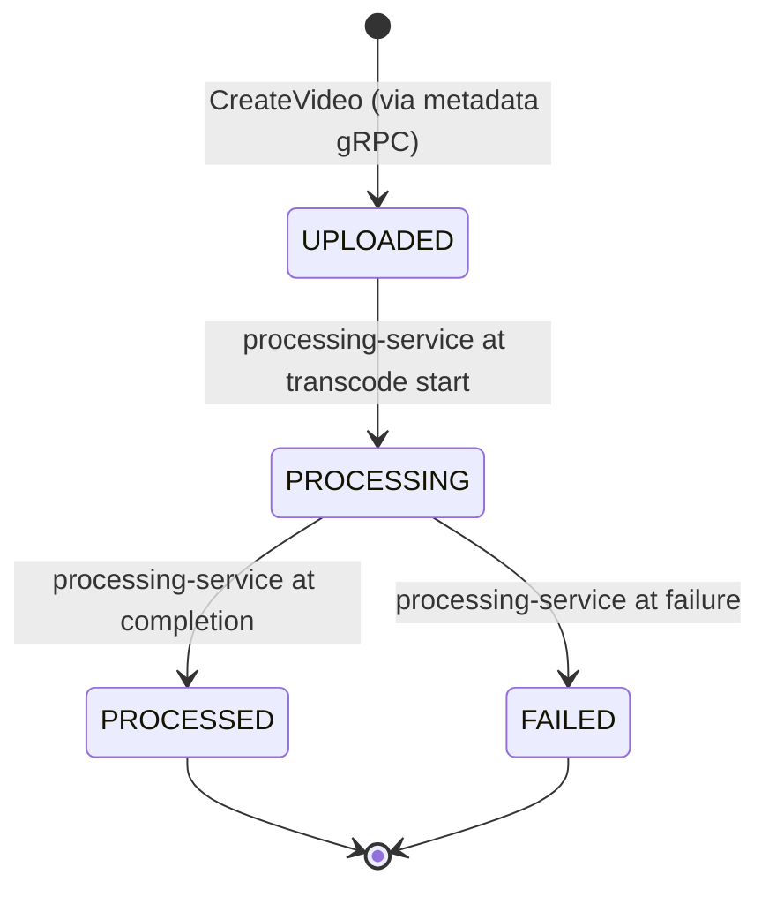
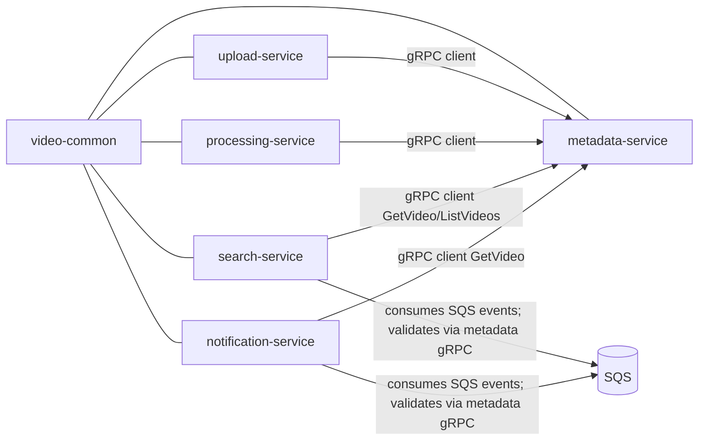
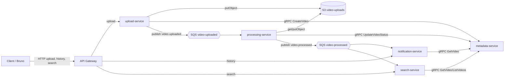
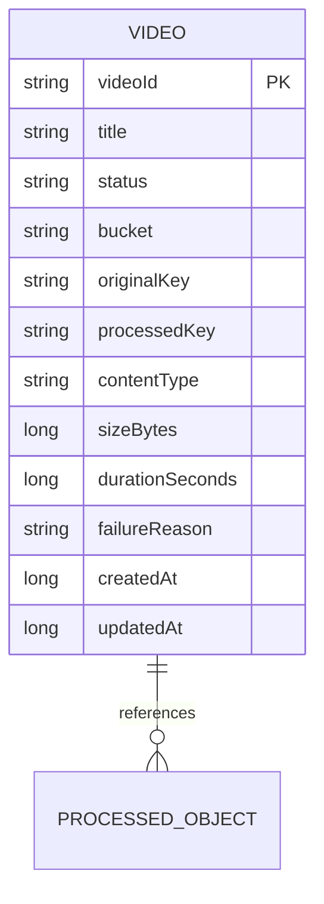

# Architecture Spine — video-processing platform

## Design Paradigm

**Layered per service, pipe across services, single door for the client.** Each of the 5 Spring Boot services is structured `boundary → service → persistence` (HTTP controller and/or `@GrpcService` in, repository out), and the system itself is a pipeline `upload → process → notify/search` whose stages are decoupled by SQS events and whose sync calls are gRPC. The client reaches a service only through one door — the API Gateway — and every backing resource lives in Terraform. The pattern is fixed at both levels because a builder can read the layers off one service but cannot read the cross-service contract, state machine, event ordering, or client ingress off any single codebase — those live in `video-common`, the Terraform config, and this spine.

Namespace map:

```text
com.videolab.<service>.<layer>   # boundary, service, repository, config, aws, events (per service)
com.videolab.proto.v1            # generated gRPC contract (video-common) — canonical shape for shared fields
com.videolab.events              # JSON event DTOs with eventId + schemaVersion (video-common)
com.videolab.common              # Names constants: queues, buckets, port/channel references (video-common)
terraform/                       # the environment: buckets, queues, API Gateway — declared here, not in code
```

## Invariants & Rules

### AD-11 — PostgreSQL for every record store (Aurora on real AWS) [ADOPTED]

- **Binds:** all 3 record stores — metadata-service (video record), notification-service (history), search-service (index); the per-service docker compose dev envelope (AD-11 container per service repo); the real-AWS path
- **Prevents:** services silently choosing different databases (H2 here, SQLite there), H2-only dev masking SQL dialect differences that surface on real AWS, and an unpinned engine that the infra phase would have to re-decide under pressure
- **Rule:** every record store runs **PostgreSQL**. Local dev: **each record-owning service declares its own `postgres` container in a `docker-compose.yml` inside its own repository** — one DB per service (`metadata` for metadata-service, `notification` for notification-service, `search` for search-service). The workspace-root `docker-compose.yml` holds only the agentic engineering workspace (ministack + its backing redis) and **never a service's database or any service-owned Docker instance** — service infrastructure lives in the service repos. Wiring is via Spring Boot `spring.datasource.*` — profile-scoped config, never hardcoded creds (AD-6). Real AWS: **Amazon Aurora, PostgreSQL-compatible**, reached through the same `spring.datasource.*` (`jdbc:postgresql://<aurora-endpoint>/<db>`) — **not** RDS, **not** SCAWS auto-config (SCAWS 4.x has no RDS/Aurora module). The engine is fixed; only the URL/credentials swap per profile. Single-writer ownership is unchanged (AD-2): one DB per service, no service reads another's database, metadata owns the record, notification owns history, search owns the index. **Title-substring search = PostgreSQL `ILIKE`** (`WHERE title ILIKE '%query%'`) — the search index is a Postgres table, not a separate search engine. `ddl-auto: update` is acceptable for the lab; schema migration tooling is deferred (infra phase).

### AD-1 — Layered per-service architecture [ADOPTED]

- **Binds:** all 5 services
- **Prevents:** builders choosing different internal structures (hexagonal in one, layered in another), or leaking persistence/business logic into boundary classes
- **Rule:** every service: boundary layer (HTTP controller and/or `@GrpcService`) → service layer (business) → repository/persistence. No business logic in boundary classes; no repository access from boundary classes. Adapters (S3/SQS/gRPC clients) are thin classes called from the service layer.

### AD-2 — Single-writer data ownership, scoped to record stores [ADOPTED]

- **Binds:** all 5 services, all record stores
- **Prevents:** two services writing one entity, or two codebases reading/writing one record store
- **Rule:** the video record is owned by `metadata-service` (the only record DB, the sole mutator); the search index is owned by `search-service` and notification history by `notification-service` — both derived from events and disposable/rebuildable; `upload-service` and `processing-service` are stateless workers. No shared **record store** (DB, index, history) between services; no service reads another service's record store; any write crosses the owning service's gRPC API.
- **S3 is content-addressed object storage, not a record store:** `upload-service` owns writes to `video-uploads`; `processing-service` reads `video-uploads` and owns writes to the processed bucket. Object ownership = who writes.
- **Identity:** `videoId` is minted exactly once, at ingress (`upload-service`), and supplied to metadata-service via `CreateVideoRequest.video_id`, which is **required** from upload-service. Metadata's generate-if-absent is a defensive fallback only (tooling/grpcurl), never a normal path. A CreateVideo retry with one's own ingress-minted id is an **idempotent success** (existing record returned unchanged); `ALREADY_EXISTS` is a collision guard for a genuinely different caller. S3 keys, events, and the record must all use the same `videoId`. Upload-level idempotency holds only within a process lifetime — a client retry after upload-service restart is a new ingress (new `videoId`), and duplicate videos from such a retry are accepted for the lab.
- **Outbox carve-out:** if a transactional outbox is ever adopted, it lives in metadata-service's DB and is written through its gRPC API — never as a new store inside a stateless worker.

### AD-3 — Video status state machine with assigned producers [ADOPTED]

- **Binds:** `metadata-service` (enforces), `upload-service`/`processing-service` (producers)
- **Prevents:** status regression under SQS redelivery, and two services both claiming to drive a transition
- **Rule:** transitions `UPLOADED → PROCESSING → PROCESSED | FAILED`; `PROCESSED`/`FAILED` are terminal. Same-status re-assertion is idempotent for the state transition (a regression or a transition out of a terminal state is rejected with gRPC `FAILED_PRECONDITION`); request-carried fields on a same-status re-assertion are still applied (overwritten), because the published event is a projection of the acknowledged payload.
- **Producer assignment:** `UPLOADED` is minted only via `CreateVideo` (metadata on upload's behalf); `PROCESSING` is minted only by `processing-service` at transcode start; `PROCESSED | FAILED` is minted only by `processing-service` at completion. `upload-service` never emits `PROCESSING`.
- **Terminal-event emission:** every terminal transition (`PROCESSED` and `FAILED`) emits exactly one event on the `video-processed` queue; the event's `status` mirrors the acknowledged store status; `failureReason` is populated iff `FAILED`. Derived stores: notification notifies on both; search excludes `FAILED`. A same-status re-assertion applies request-carried fields to the store **only** and emits no event — the event for a transition is emitted once, with the payload acknowledged at the transition; a derived store may therefore lag the record after a re-assertion (accepted).
- **Status-first ordering:** `UpdateVideoStatus` completes (and metadata acknowledges the transition) **before** the corresponding event is published; a terminal event is published only after the terminal transition is acknowledged.



### AD-4 — SQS consumer idempotency keyed on eventId [ADOPTED]

- **Binds:** `processing-service`, `search-service`, `notification-service` (all consumers)
- **Prevents:** duplicate derived entries and duplicate work on redelivery
- **Rule:** every event DTO carries `eventId` and `schemaVersion`. `eventId` is **deterministic** — a name-based UUID derived from the logical transition, `UUID.nameUUIDFromBytes((videoId + ":" + status).getBytes())` — so it is stateless and restart-proof: redelivery and publish retry automatically reuse the same id (a retry is an idempotent republish, never a new id). "Exactly one event per transition" therefore holds across process restarts. Idempotency is keyed on `eventId`; `videoId` is the domain key for merge/upsert semantics. Each derived store declares its natural key: search index = `videoId` (single row per video); notification history = `eventId` (append per unique event). `processing-service` treats a duplicate `video.uploaded` for an already-processing/terminal video as a no-op.
- **Normative queue subscriptions:** `processing-service` subscribes only to `video-uploaded`; `search-service` and `notification-service` subscribe only to `video-processed`. A video becomes searchable only when its terminal `PROCESSED` event is consumed — search indexes only `status=PROCESSED`, on the consume path and on the `ListVideos` rebuild path alike.
- **Producer handling of rejection:** `processing-service` treats `FAILED_PRECONDITION` on its own `UpdateVideoStatus` attempt for a redelivered `video-uploaded` as the AD-4 no-op signal — ack the message and take no further action (no metadata lookup, no retry, no re-transcode).

### AD-5 — Versioned-from-day-one shared contract [ADOPTED]

- **Binds:** `video-common` (`.proto` and JSON event DTOs)
- **Prevents:** class collisions, field-renumber corruption, and one breaking change breaking every consumer simultaneously
- **Rule:** proto field numbers and message names are immutable within a version — additive-only. A renumber/rename/remove is a breaking change → new proto package version (`videolab.v1` → `videolab.v2`) with a version-scoped `java_package` (`com.videolab.proto.v1`); during coexistence a gRPC server MUST expose both versions until all consumers migrate. Each service pins the contract version it compiles against. JSON events carry `schemaVersion`; an event `schemaVersion` bump is a breaking change requiring a **coordinated cutover** — all consumers deploy before the publisher switches (verified by a named ops signal or a dual-publish window); rejection of an unknown version is the failure mode, not the plan. A dual-publish window still emits one `eventId` per transition — the republish is a dedupe, not a second row; `schemaVersion` is payload, not event identity. The additive-only rule extends to the event DTOs.

### AD-6 — Config not code (environment envelope) [ADOPTED]

- **Binds:** all 5 services, all AWS and gRPC client wiring
- **Prevents:** hardcoded endpoints/credentials that force a rewrite when the environment changes
- **Rule:** no AWS endpoint, region, credential, or gRPC target is ever built in code; all live in `application.yml` via Spring Cloud AWS (`spring.cloud.aws.*`) and `spring.grpc.client.channel.<name>.target`. `spring.cloud.aws.s3.path-style-access-enabled=true`, region, and endpoints are **profile-scoped config** — the default profile is ministack (`http://localhost:4566`, dummy creds); a real-AWS profile overrides them, never a universal literal. gRPC client channel names are pinned: `channel.metadata` for metadata-service (used by upload-service and processing-service for writes, and by search-service/notification-service for validation/rebuild reads), `channel.search` for search-service. The port table below is **normative** — every service's `application.yml` must match it; changing a port is a spine change. **Names authority:** queue/bucket names (and the gateway route paths, AD-9) are declared in Terraform (`terraform/`) — that is where a name is changed; `com.videolab.common.Names` mirrors them for the JVM side and MUST match; services compile against `Names` and never string-type a queue/bucket name inline. **Enforcement:** the verification story MUST include an assertion that `com.videolab.common.Names` equals the `terraform output` names (or an equivalent check), and the build/verification FAILS on divergence; a rename is one coordinated change (Terraform + `Names` + the assertion in the same commit), never an in-place edit in one place only. Physical URL/account is config; logical names are declared once in Terraform.

### AD-7 — Error semantics [ADOPTED]

- **Binds:** all gRPC services and HTTP facades
- **Prevents:** each service inventing its own error vocabulary, status mapping, or envelope
- **Rule:** gRPC returns standard status codes only; HTTP facades map per this table and return the gRPC description verbatim in `{"error": "<description>"}`.

| gRPC status | HTTP |
| --- | --- |
| `INVALID_ARGUMENT` | 400 |
| `NOT_FOUND` | 404 |
| `ALREADY_EXISTS` | 409 |
| `FAILED_PRECONDITION` | 409 |
| `INTERNAL` | 500 |

Any gRPC status not listed maps to 500. AD-7 binds all client-facing surfaces (the gateway-exercised set, AD-9). SSE is internal/in-memory only in this lab — there is no client-exposed SSE surface; SSE framing rules stay Deferred with the live-SSE item.

### AD-8 — Event trust model + publisher allow-list [ADOPTED]

- **Binds:** all publishers and all SQS consumers
- **Prevents:** phantom events (indexing/notifying state the owner never ratified) and a derived service accidentally becoming a second producer
- **Rule:** events are projections of owner-confirmed state, not independent assertions; publishers complete the owning write (status-first, AD-3) before publishing. Only `upload-service` publishes `video-uploaded`; only `processing-service` publishes `video-processed` — the allow-list governs **who may cause** a publish. A transactional-outbox relay inside metadata-service is transport on the producer's behalf, not a second producer: it is permitted only via the AD-2 outbox path and never invents an event metadata did not commit. A reconciliation re-enqueue (R4/Deferred) is likewise transport on the producer's behalf, never a store write. metadata-service is the source of truth for existence and status; poison means a **successful negative lookup** — metadata returns `NOT_FOUND` for a `videoId` the consumer has no evidence the owner wrote. `UNAVAILABLE`/deadline errors are transient and retried, never dropped. The metadata-validation duty applies to derived-store consumers (search, notification) on terminal events; `processing-service`'s duplicate no-op is status-based and performs no metadata lookup.

### AD-9 — Single client ingress through the API Gateway [ADOPTED]

- **Binds:** `api-gateway` (ministack API Gateway v2 HTTP API, Terraform-provisioned), the client-facing HTTP facades (upload, notification history, search), the client (Bruno)
- **Prevents:** clients reaching a service directly and learning service topology, gRPC becoming a client surface, each service inventing its own client-facing entry point
- **Rule:** the API Gateway is the **only door** for client HTTP traffic. The **client-facing surface is enumerated** — exactly three journeys: upload, status history, search — and all three target the gateway (never `localhost:8080/8081/8082/8090/8091` directly); the gateway routes by path to the correct service HTTP facade. **The gateway route path MUST equal the facade's full client path** (`/api/videos/*`) with **no path rewriting at the edge** — the single authoritative path table below is carried in this spine, and the facade `@RequestMapping` must mirror it (same assertion mechanism as AD-6's names check). The gateway integrates to the host facades via `host.docker.internal:<port>` (services run as host JVMs; the root compose runs ministack + redis only — each service's own database runs from a compose file inside that service's repo, AD-11). Responses pass through the gateway **unchanged** (status codes and `{"error": ...}` bodies per AD-7) — no remapping at the edge. For the upload route the integration payload format is pinned to **1.0 passthrough** with `multipart/form-data` and the binary media types listed; a real multipart upload **through the gateway** is an acceptance gate for the gateway story (not a facade-local test). gRPC is strictly service-to-service and is **never** gateway-exposed (FR-23). Direct gRPC from the client stays a debugging/inspection surface (e.g. verifying metadata state). A direct client HTTP call to a service port is **outside the exercised path** — not exercised, not formally banned (PRD FR-21 wording kept). Non-client services hold **no HTTP facade**: metadata (8090) and processing (8081) web ports serve actuator/health only; the search rebuild trigger is **gRPC/admin only** (no HTTP surface, no gateway route). The gateway is **not a service**: it holds no state, is not part of the layered per-service structure, and carries no domain logic. No auth on the gateway in the lab.

Authoritative client-path table (gateway route = facade path, no rewriting):

| Client journey | Gateway path (= facade path) | Target service |
| --- | --- | --- |
| Upload | `POST /api/videos/upload` | upload-service (:8080) |
| Status history | `GET /api/videos/{videoId}/history` | notification-service (:8082) |
| Search | `GET /api/videos/search?title=` | search-service (:8091) |

### AD-10 — Terraform-managed ministack infrastructure [ADOPTED]

- **Binds:** `terraform/` (the .tf config), all ministack backing resources (uploads/processed buckets, `video-uploaded`/`video-processed` queues, API Gateway v2 API/routes/integrations/stage), the setup/teardown and verification procedure
- **Prevents:** out-of-band resource creation (`aws cli` or ad-hoc control-plane calls) and an irreproducible lab bring-up — nothing more. Cross-boundary consistency (Terraform names vs `Names`, route path vs facade path, invoke URL) is **not** provided by Terraform and is governed by the AD-6/AD-9 enforcement hooks.
- **Rule:** every backing resource is declared in Terraform and created by `terraform apply` against ministack — nothing is created out-of-band. The AWS provider targets `http://localhost:4566` (`endpoints{}` overrides, `s3_use_path_style=true`, dummy creds, skip credential validation / metadata check). **Bring-up order is fixed: `docker compose up` at the workspace root (ministack + redis) → `docker compose up` per record-owning service repo (that service's `postgres`, AD-11) → `terraform apply` → services boot last; a running service that survives a `terraform destroy` + re-apply MUST be restarted (queue/bucket URLs change).** Verification runs on a clean `destroy` + `apply`; `terraform apply` is owned by the verification story (`mvn package` + compose-up smoke run against the applied result). The documented setup/teardown contains no `aws` CLI invocations. **Gateway contract pinned here:** the API Gateway uses a named stage (`dev`) with a deployment, and `terraform output` exposes the invoke URL (apiId + stage + path) to the client config/README; a route without a stage+deployment is forbidden. Local state only — no remote state, modules, or workspaces for the lab. Real AWS is the infra phase: only the provider config **and integration addressing** swap — names will need env-scoped prefixes on real AWS, so the swap is a constraint to re-verify in the infra phase, not a property of this config.

Dependency direction — who may depend on whom:



No service depends on another service's record store; every cross-service sync dependency is gRPC through `video-common`. `search-service`/`notification-service` depend on `metadata-service` for event validation (AD-8) and search rebuild (`ListVideos`).

## Consistency Conventions

| Concern | Convention |
| --- | --- |
| Naming (entities, files, interfaces, events) | Packages `com.videolab.<service>.<layer>`; events verb-in-past (`video.uploaded`, `video.processed`); queue/bucket names declared in Terraform and mirrored in `com.videolab.common.Names`, never string-typed inline (AD-6); gateway route paths declared in Terraform (AD-10); gRPC channel names `channel.metadata` / `channel.search` |
| Data & formats (ids, dates, error shapes, envelopes) | `videoId` UUID minted at ingress (AD-2); every event carries `eventId` + `schemaVersion`; all timestamps epoch-millis `int64`; SQS payloads JSON via Jackson; gRPC `VideoInfo` is the canonical shape for fields it shares with events; HTTP error body `{"error": ...}` (AD-7); HTTP facade paths under `/api/videos/*` with response DTOs in `video-common`; client paths behind the gateway route to these facades (AD-9) |
| State & cross-cutting (mutation, errors, logging, config) | Status mutated only through metadata-service gRPC (AD-3); logging = Spring Boot defaults (logback, INFO, `com.videolab` loggers); config only in `application.yml` (AD-6); every service exposes actuator health (+ gRPC health on gRPC servers); port table below is normative |

Normative port table (service ports are internal — the gateway is the client door, AD-9):

| Service | Web / HTTP | gRPC |
| --- | --- | --- |
| upload-service | 8080 | — |
| processing-service | 8081 | — |
| notification-service | 8082 | — |
| metadata-service | 8090 | 9090 |
| search-service | 8091 | 9091 |

| Edge | Port |
| --- | --- |
| API Gateway (ministack, Terraform-provisioned) | 4566 (client HTTP via execute-api path) |

## Stack

| Name | Version |
| --- | --- |
| Java | 21 |
| Spring Boot | 4.1.0 |
| Spring Cloud AWS | 4.1.0 (BOM import) — confirm 4.1.0 × Boot 4.1.0 pairing at first build; 4.x has no RDS auto-config |
| Spring gRPC | 1.1.0 via `spring-boot-starter-grpc-server` / `spring-boot-starter-grpc-client` (Boot 4.1-managed; grpc-java 1.80.0, protobuf via Boot BOM) |
| Protobuf codegen | `io.github.ascopes:protobuf-maven-plugin` 5.x (pin an explicit 5.x version — not Boot-managed; plugin version is not provided by the Boot BOM) |
| Build | Maven, multi-module |
| Record stores (metadata, notification, search) | PostgreSQL (dev, one container per service in that service's own repo, one DB per service); real AWS = Aurora PostgreSQL-compatible via Spring Boot `spring.datasource.*`, not SCAWS (AD-11) |
| AWS emulation (dev) | ministack at `http://localhost:4566` (S3 + SQS + API Gateway v2), **image tag pinned ≥ 1.3.6** — the `/_aws/execute-api/...` path-based data plane (PRD A-2) needs ≥1.3.6; pin the exact tag in compose |
| Infra provisioning (dev) | Terraform (AWS provider pinned; `endpoints{}` → `http://localhost:4566`, `s3_use_path_style=true`, local state) — `terraform/` at repo root |
| processing-service | ffmpeg binary (runtime option; demo-mode copy fallback) |
| Deployment | 1 Dockerfile per service — all images `eclipse-temurin:21-jre`, expose only the normative ports, actuator healthcheck; only the ffmpeg layer is deferred |

## Structural Seed



```text
{root}/
  pom.xml                          # parent, modules: video-common + 5 services
  video-common/                    # proto, events, Names — the shared contract + canonical shapes
  upload-service/                  # ingest boundary; stateless; mints videoId
  processing-service/              # transcode worker; stateless; sole PROCESSING/PROCESSED/FAILED producer
  metadata-service/                # source of truth; sole record DB; enforces AD-3
  notification-service/            # derived history (client surface via gateway)
  search-service/                  # derived index + gRPC/HTTP search (client surface via gateway)
  terraform/                       # buckets, queues, API Gateway — the environment, applied via terraform apply
  docker-compose.yml               # agentic engineering workspace only: ministack (AWS emulation) + its backing redis; NO service instances here (AD-11)
```

Every record-owning service carries its own `docker-compose.yml` in its own repository (e.g. `video-processing-ms/metadata-service/docker-compose.yml` with its `postgres` using the Docker named volume `metadata-postgres-data`) — service-owned Docker instances never live in the root compose, and their runtime data never uses bind-mounted folders (`docker compose down -v` removes it cleanly).

Core entity (names only):



## Capability → Architecture Map

| Capability / Area | Lives in | Governed by |
| --- | --- | --- |
| Video record CRUD + status | metadata-service | AD-2, AD-3, AD-7 |
| Upload ingest (HTTP → S3) + identity | upload-service | AD-1, AD-2, AD-6, AD-8 |
| Transcode + S3 output | processing-service | AD-1, AD-2, AD-3, AD-4, AD-6, AD-8 |
| Status history query | notification-service | AD-2, AD-4, AD-7, AD-8, AD-9 |
| Search | search-service | AD-2, AD-4, AD-8, AD-9 |
| Client ingress (HTTP edge) | API Gateway (terraform/) | AD-9 |
| Ministack infrastructure (buckets, queues, gateway) | terraform/ | AD-6, AD-10 |
| gRPC + event contract | video-common | AD-5, AD-7 |
| Env wiring (ministack/AWS) | application.yml per service | AD-6 |

## Deferred

- **Real AWS + kubernetes + DNS discovery + secrets management** — infra work is a later phase; AD-6 keeps the code ready. Revisit when infra starts.
- **CI/CD** — no pipeline decision until all 5 services exist; verification is `mvn -q -DskipTests package` + compose-up smoke tests, run against a clean `terraform destroy` + `apply` result (AD-10). Revisit when the infra phase starts.
- **Dual-channel consistency** — the gRPC status write and the SQS publish are not atomic. Status-first ordering (AD-3) makes the happy path deterministic; the residual failure mode is "owner advanced, event missing". A **reconciliation job** (periodic, reads metadata as truth) is the accepted mitigation when divergence is observed; the outbox, if ever needed, must follow the AD-2 carve-out. Reconciliation corrects only stores whose natural key is metadata-derivable (search index by `videoId`); notification history is append-only, keyed on `eventId`, and is **not** reconciliation-corrected — a missing notification is accepted (SSE is best-effort), and duplicate history rows from a republish under two `eventId`s are deduped.
- **Ingest-leg orphan** — the ingest leg (CreateVideo + publish `video-uploaded`) is not reconciled: a lost `video-uploaded` orphans the video in `UPLOADED` (accepted for the lab; the FAILED/reprocessing story is the future retry path). If re-drive is desired later, reconciliation may re-enqueue `video-uploaded` as transport — never as a store write.
- **Derived-store recovery** — search index rebuildable from `metadata-service.ListVideos`; notification history from retained events.
- **SQS DLQ / retry / dead-letter policy** — not needed for the happy path; add when failure handling matures.
- **Dedupe retention** — dedupe store retention ≥ SQS visibility/redelivery window, and whether dedupe may be in-memory (ministack lab) vs durable (real AWS).
- **Search index schema** beyond title-substring matching — expand when search requirements exist.
- **Live SSE as a client surface** — removed from the client-facing seed; the MVP status surface is the history query through the gateway (AD-9). SSE exists only as internal/in-memory history here. Revisit if live streaming is wanted.
- **Notification delivery** beyond in-memory SSE history — expand when a real channel (email/push) is required.
- **API Gateway** beyond the minimal lab — auth, rate limiting, usage plans, custom domains, WebSocket, stage/deployment mechanics — deferred; the lab gateway is open and minimal.
- **Terraform** beyond the minimal lab — remote state, modules, workspaces, providers beyond AWS — deferred; local state suffices. The ministack gateway invoke-URL pattern is pinned in the gateway Terraform story (AD-10: named stage `dev` + deployment, `terraform output` feeds the client URL).
- **FAILED-video reprocessing flow** — terminal `FAILED` is final; retry semantics are a future feature.
- **Observability** — tracing and metric aggregation across services; actuator + gRPC health and logback defaults suffice for now.
- **ffmpeg provisioning** — how the binary is installed in the processing image is left to the Dockerfile story.
- **Search rebuild surface beyond gRPC/admin** — the FR-20 rebuild trigger is gRPC/admin only in this lab (AD-9); a client-exposed rebuild surface is deferred.
